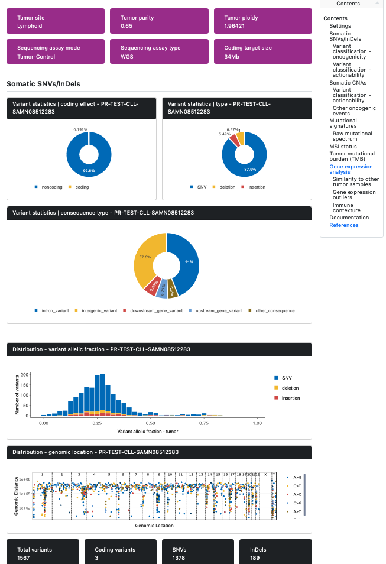

# Tamor

Rapid automated generation of cancer genome mutation reports, starting from FASTQ-formatted sequence files. 

Generates [Personal Cancer Genome Reports](https://sigven.github.io/pcgr/) (PCGR) and [Djerba Reports](https://github.com/oicr-gsi/djerba) using 
[Illumina Dragen](https://www.illumina.com/products/by-type/informatics-products/dragen-secondary-analysis.html) + 
[Snakemake](https://snakemake.github.io/), handling both genomic and transcriptomic input data. 
Catalogues as conforming to [Standardized Snakemake Workflow](https://snakemake.github.io/snakemake-workflow-catalog/#standardized) rules for reproducibility.

# tl;dr

Data for large scale tumor analysis projects can be spread over multiple DNA sequencing instrument runs, ``Tamor`` simplifies the process of analyzing them.

Tab-delimited files are configured by the user to associate tumor (DNA and/or RNA) and germline sequencing sample IDs with a study subject ID, along with a tissue-of-origin for the tumor. 
Somatic variants (including small nucleotide variants, structural variants and copy number variants) as well as gene expression reports are generated using 
1) these tab-delimited files
2) the Illumina sequencer output (BCL or FASTQ), and
3) the Illumina Experiment Manager samplesheets (CSV) for the sequencing runs

# Table of Contents
* [Prerequisites](#prerequisites)
* [Installation](#installation)
* [Testing](#testing)
* [Running Tamor](#running-tamor)
* [Configuration](#configuration)
* [Acknowledgements](#acknowledgements)

# Prerequisites

This workflow is intended for people with an Illumina Dragen hardware-accelerated (FPGA) system for high-throughput genomics analysis.  
If you don't have this hardware, this probably isn't for you.

*This code has been tested with Dragen version 4.2 only.*

If you are the sole user of the Dragen system, luck you: that's it! If there is potentially more than one user of the Dragen system, you will 
also need to set up a [slurm](https://slurm.schedmd.com/quickstart_admin.html#quick_start) queue so that jobs running on the Dragen FPGA don't collide with each other.
This is recommended by Illumina support, but not part of the Dragen documentation.

# Installation

0. [Install the mamba package manager](https://mamba.readthedocs.io/en/latest/installation/mamba-installation.html) if you don't already have it on your system.

1. Create a mamba or conda environment for the latest Snakemake (8.something) and utilities:

```bash 
mamba create -c conda-forge -c bioconda -n snakemake snakemake git git-lfs wget conda=24.7.1
mamba activate snakemake
pip install snakemake-executor-plugin-slurm
```
2. Download the Tamor code:

```bash
git clone --recurse-submodules https://github.com/nodrogluap/tamor
cd tamor
```

3. OPTIONAL. Tamor builds on a number of awesome existing bioinformatics software packages, which in turn depend on *lots* of other packages.
We have tried to alleviate the pain involved in resolving these dependencies by using 'pinned' conda package lists for Linux. 
*But* there is some chance that your default conda setup is incompatible with these pins. 
If you run into conda errors while running Tamor for the first time, please try using the following ``~/.condarc`` file:

```yaml
channels:
  - bioconda
  - r
  - defaults
  - conda-forge
channel_priority: flexible
```

# Testing

Tamor follows the Snakemake [Distribution and Reproducibility](https://snakemake.readthedocs.io/en/stable/snakefiles/deployment.html) guidelines, so files are located in standardized locations.
The default config files are pre-configured for running a single test case from the [NCBI Short Read Archive](https://www.ncbi.nlm.nih.gov/bioproject/PRJNA433607).  This case of apparent Chronic
Lymphocytic Leukemia (CLL) has both tumor DNA (30x coverage) and RNA data (27M) available, both 2x150bp paired-end Illumina.

If you would like to run the test case before reconfiguring Tamor to use your own data, you will need to download and format the CLL SRA records. 
This requires some additional specialty software not otherwise required by Tamor, so you will need to install a test mamba environment first.

```bash
mamba env create -f workflow/envs/test.yaml
mamba activate test
workflow/scripts/download_testdata.py
mamba deactivate test
```

This can take a few hours depending on your Internet connection speed, and requires at least 40GB of RAM to generate matched-pseudonormal FASTQ files from the cancer sample FASTQ files.

# Running Tamor

*NOTA BENE!!! The first time you run Tamor, it will download (~22GB) the cancer annotation databases that [CPSR](https://github.com/sigven/cpsr) and PCGR rely on for annotating your discovered sequence variants, by automatically running the ``workflow/scripts/download_resources.py`` script. This will likely take several hours. If you interrupt that process, you will need to run that script manually.*

Once either the test data or your own (see [Configuration section below](#configuration)) is ready, you can run Snakemake to generate the 
[BAM](https://en.wikipedia.org/wiki/Binary_Alignment_Map) files, 
[VCF](https://en.wikipedia.org/wiki/Variant_Call_Format) files, and 
[CPSR/PCGR reports](https://sigven.github.io/pcgr/index.html). 
Generation of Djerba reports is dependent on you providing a valid API token linked to your [registered OncoKB account](https://www.oncokb.org/account/register).

On a single-user system:

```bash
snakemake --use-conda -j 1
```

Otherwise, on a multi-user system, it is imperative to use a queuing system such as slurm to submit only one job at a time to Dragen v4.x. 
Once slurm is installed and configured on your Dragen system, Snakemake support for slurm is enabled by invoking like so:
  
```bash
snakemake --use-conda -j 1 --executor slurm
```

Regardless of the invocation method used above, the default outputs are in a directory called ``results/pcgr/projectID/subjectID_tumorSampleID_germlineSampleID``. 
The most relevant document may be the self-contained Web page ``subjectID.pcgr.grch38.html``.



After a successful workflow run, additional reporting information (including provenance) can be aggregated into a self-contained HTML report using 
Snakemake's automated workflow reporting tool:

```bash
snakemake --report report.html
```

# Configuration

Detailed configuration information for importing your own cancer cases for processing is available [in the config dir](config/README.md).

# Acknowledgements

The results generated here for gene expression comparison are in part based upon data generated by the TCGA Research Network: <https://www.cancer.gov/tcga>
Somatic variants are filtered against a subset of the [gnoMAD database](https://gnomad.broadinstitute.org/), 
which is included in this repository.

This project is being developed in support of the [Terry Fox Research Institute](https://www.tfri.ca/)'s 
[Marathon of Hope Cancer Care Network](https://www.marathonofhopecancercentres.ca/) activities within the 
[Prairie Cancer Research Consortium](https://www.marathonofhopecancercentres.ca/our-network/consortium/prairies-cancer-research-consortium).
