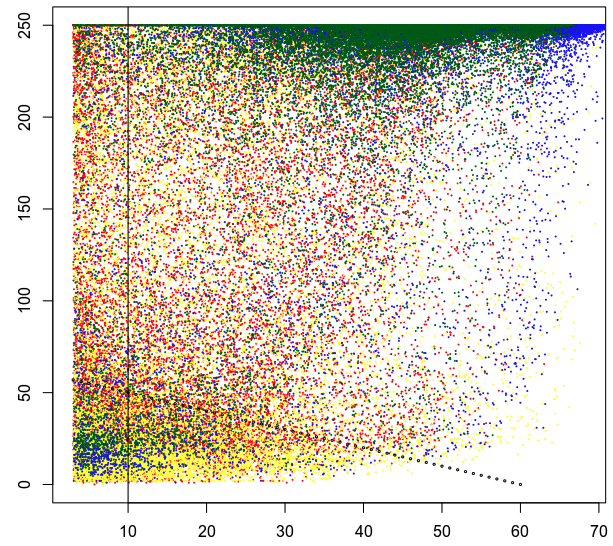

*NOTA BENE!!! When running snakemake for the first time with this repository, it may take many hours, as it will download both all the software environment needed to run [PCGR](https://sigven.github.io/pcgr/) mutation impact reports, and all the large public resource files needed for the same (by automatically running ``workflow/scripts/download_resources.py``). If you intererupt the downloading and unpacking of these files, you will need to rerun the download script manually.*


# Configuring Tamor to Analyze Your Cancer Cases

Cases are organized into logical units: Projects (a.k.a. cohorts), that have Subjects (a.k.a. patients) that have Samples (e.g. biopsy or blood).  

Cases from the same cohort will be outputted into the same output folder, for organizational purposes.

A Subject must have at least one normal/germline sample. We may expand to support tumor-only analysis in the future.

A Subject can have one or more tumor samples (e.g. primary and refractory).
Each tumor must have a DNA sample, and optionally an RNA sample. 

# Table of Contents
* [Test Case Defaults](#test-case-defaults)
* [Site-specific customizations](#site-specific-customizations)
* [DNA Sample Metadata](#dna-sample-metadata)
* [RNA Sample Metadata and transcript blacklist](#rna-sample-metadata)
* [Illumina Samplesheets](#illumina-samplesheets)
* [Unique Molecular Indices](#unique-molecular-indices)
* [False Positive Variant Filtering](#false-positive-variant-filtering)

## Test case defaults

The default config files are preconfigured for didactic purposes with a public leukaemia genome+transcriptome case from the NCBI Short Read Archive.
This case is part of the cohort ``PR-TEST-CLL``, with the patient labelled as ``PR-TEST-CLL-SAMN08512283``, and there are three sets of input FASTQ files
downloaded/generated by running ``workflow/scripts/download_testdata.py``. The three samples are ``PR-TEST-CLL-SAMN08512283-SRR6702602-T`` (tumor DNA)
, ``PR-TEST-CLL-SAMN08512283-SRR6702602-N`` (pseudonormal DNA generated by the script since no actual normal is available), and 
``PR-TEST-CLL-SAMN08512283-SRR6702601-T`` (tumor RNA). Such long systematic names are not *necessary*, but in practice we have found them very useful as
you start accumulating larger cohorts.

Sequencing instrument run IDs and sample IDs are typically rather opaque and automatically assigned by the sequencing lab. 
These are not part of the config files, nor reported out by Tamor, but rather 
linked to designated Subjects and Samples via the [Illumina Samplesheets](#samplesheets).

## Site-specific customizations

### Site-specific file paths

``config/config.yaml`` is the file that you can customize for your site-specific settings. 
By default the config is set up to read input files from the ``resources`` folder, and write result files under the ``results`` folder. 
By default the genome index and annotation files, as well as the PCGR data bundle, are expected in ``resources``. 
This is where ``workflow/scripts/download_resources.py`` puts those files.

Tamor's default config has the input lists of paired tumor-normal samples (with minimal metadata, described below) in files called ``config/dna_samples.tsv`` and ``config/rna_samples.tsv``.
These TSVs are the main config files that you will need to edit to run your own samples through the workflow. Config files are internally validated for completeness based on ``workflow/schemas/dna_sample_config.schema.yaml`` and ``workflow/schemas/rna_sample_config.schema.yaml``.

### Site-specific file permissions and group ownership

On systems where multiple users will generate or use the Tamor analysis, it can be useful to have the workflow automatically set shared permissions for the output files.
Uncommenting the ``set_output_group`` and ``set_output_umask`` lines in ``config/config.yaml`` will make Tamor try to honour those wishes. As per UNIX convention, a umask of 007 
will allow read/write by the owner and designated group, but give no permissions to others.

## DNA Sample Metadata
The ``config/dna_samples.tsv`` file has 8 columns to be specified with column names:

```
subjectID<tab>
tumorSampleID<tab>
trueOrFalseTumorHasPCRDuplicates<tab>
germlineSampleID<tab>
trueOrFalseGermlineHasPCRDuplicates<tab>
trueOrFalseGermlineContainsSomeTumor<tab>
oncoTreeCode<tab>
projectID
```
Details on how to set each column are below.

### Sample IDs
The ``subjectID``, ``tumorSampleID`` and ``germlineSampleID`` must:

- *CONTAIN NO UNDERSCORES*
- The ``subjectID`` must be between 6 and 35 characters (due to a PCGR naming limitation)
- ``tumorSampleID`` and ``germlineSampleID`` must be the exact ``Sample_Name`` values you used in your Illumina sequencing sample spreadsheets (see samplesheet section below for details).

### Handling PCR duplicates
The *third* and *fifth* column tell Dragen whether to consider (in tumor and germline respectively) as PCR duplicates read pairs that map to the same start and end in the reference genome. 
If you used a PCR-free library prep, set this to ``False``, otherwise set it to ``True``.

### Project designation
The *eighth* column is a unique project ID to which the subject belongs. For example if you have two cohorts of lung and breast cancer, 
assigning individuals to two projects would be logical. 
All project output files go into their own output folders, even if they were sequenced together on the same Illumina sequencing runs.

### Tumor-in-normal handling 
The *sixth* column of the paired input sample TSV file is usually ``False``, unless your germline sample is from a leukaemia or perhaps 
a poor quality histology section from a tumor, in which case use ``True``. This instructs Dragen to consider low frequency variants 
in the germline sample to still show up as somatic variants in the tumor analysis output (see default of 0.05 under ``tumor_in_normal_tolerance_proportion`` in ``config.yaml``)

### Cancer type designation
For the *seventh* column, the type of cancer the tumor represent must be coded. This is preferably an OncoTree code. Those codes can be found here: <https://oncotree.mskcc.org/> 
This information will be used to customize some parts of the variant, gene expression, and immune profiling reports. 
If no cancer type information is available at all, you can use the top-level code in OncoTree: "TISSUE".
While OncoTree codes are preferred, Tamor will also attempt to uniquely map codes from the 
[ICD-O](https://www.who.int/standards/classifications/other-classifications/international-classification-of-diseases-for-oncology), 
[NCIt](https://evsexplore.semantics.cancer.gov/evsexplore/welcome?terminology=ncit), 
[UMLS](https://www.nlm.nih.gov/research/umls/index.html) and 
[HemeOnc](https://dataverse.harvard.edu/dataverse/HemOnc) systems.

## RNA Sample Metadata

The ``config/rna_samples.tsv`` file has 5 columns to be specified with column names:

```
subjectID<tab>
tumorRNASampleID<tab>
matchedTumorDNASampleID<tab>
projectID<tab>
cohortNameForExpressionAnalysis
```

If you have both normal and tumor RNA samples available, it is critical to list the tumor RNA sample first.  
The first RNA sample listed in the file is the one that will be included on the PCGR report for ``matchedTumorDNASampleID``,
and typically you want to report out regarding the tumor RNA.

The last column ``cohortNameForExpressionAnalysis`` is used for Djerba cohort reporting, e.g. to identify Z-score and percentile 
rank outliers genes in this sample compared to others being processed at the same time and nominally of the same cancer/tissue type as defined by the user.

### RNA Transcript Blacklist

If the RNA samples provided to Tamor have been prepared using ribosomal depletion rather than polyA mRNA capture, [this file](transcript_id_comparison_blacklist.tsv) helps mitigate non-polyadenylated 
mRNAs (primarily histones) from showing up in RNA expression outlier reports relative to polyA-based cohorts like TCGA. This file can be customized to include
addition systematic false positive outliers you observe in your cohorts relative to publicly available data.

## Illumina Samplesheets
These sample sheets are the only other metadata to which Tamor has access. Place all the 
[Illumina experiment sample sheets](https://support.illumina.com/downloads/sample-sheet-v2-template.html) for your project 
into ``resources/spreadsheets`` by default (see the ``samplesheets_dir`` setting in ``config/config.yaml``). They must be 
called ``runID.csv``, where runID is typically the Illumina folder name in the format ``YYMMDD_machineID_SideFlowCellID``.

### FASTQ File Location
If you are providing the FASTQs directly as input to Tamor, they must also be in the ``resources/analysis/primary/sequencerName/runID`` directory, 
with a corresponding Illumina Experiment Manager samplesheet ``resources/spreadsheets/runID.csv``. *Why?* This is required because Tamor reads the sample 
sheet to find the correspondence between Sample_Name and Sample ID for each sequencing library, also analysis for DNA samples differs from that for RNA 
samples, so the sample sheet must also contain a ``Sample_Project`` column. Sample projects with names that contain "RNA" in them will be processed as such, 
all others are assumed to be DNA. The ``Sample_Project`` is not used for any other purpose than distinguishing RNA and DNA, and does not need to be the 
same as the projectIDs listed in the ``config`` folder files.

*If you provide FASTQ files directly, they must be timestamped later than the corresponding Illumina Experiment Manager spreadsheet, 
otherwise Snakemake will assume you've consequentially changed the spreadsheet and try to automatically regenerated all FASTQs 
for that run -- from potentially non-existent BCLs*.

### Samples Split Across Multiple Runs

Note that a sample can actually be sequenced across multiple runs, Tamor will aggregate the sequence data across the runs to
generate a single report (e.g. a primary run and some top-up sequencing due to unexpected low read count on the first run). The
same sample name can have the same sample ID or different sample IDs across runs, they will be aggregated regardless. This allows
for a single tumor sample to be prepared using two different sequencing library preps for example.

### BCL File Location (optional)

If you are starting with BCLs, the full Illumina experiment output folders (which contain the 
requisite ``Data/Intensities/Basecalls`` subfolder) are expected by in ``resources/bcls/runID`` (see ``bcl_dir`` setting in``config.yaml``). Tamor will perform BCL 
to FASTQ conversion, with the FASTQ output into ``results/analysis/primary/sequencer/runID`` (see ``analysis_dir`` setting in ``config.yaml``, and the 
default ``sequencer`` is ``HiSeq`` per the test data mentioned earlier).

## Unique Molecular Indices

The samplesheet is also used to determine if Unique Molecular Indices (UMIs) were used to generate the sequencing libraries, which requires 
different handling in Dragen during genotyping downstream. Use of UMIs is determined by the presence of an OverrideCycles setting in the samplesheet
that includes a "U" value. By default, random UMIs are assumed. To specify a non-random UMI scheme, uncomment the ``umi_whitelist``, ``umi_correction_table``, and 
``umi_slippage_support_informative_fraction`` settings in ``config/config.yaml`` as appropriate. 

## False Positive Variant Filtering

False Positive Filtering in Tamor into three main categories: low quality thresholding, systematic noise filtering, and specific customizable blacklisted genome locations.
Each is configurable and described below.

### Low Quality Metrics and Thresholding 

While the default site quality threshold for somatic small nucleotide variant calls in Dragen is moderately stringent (Phred score of ~17, which translates to 95% FP exclusion), the default for germline variants is only 3 (only ~5% FP exclusion). Especially for germline sequencing derived from FFPE samples, this can lead to the reporting of many false positive coding variant changes that might imply germline cancer susceptibility (e.g, in mismatch repair proteins) in CSPR/PCGR reports, or erroneous pharmacogenomic indications.  In the following dotplot,
the X axis is site quality, and the Y axis is mapping quality, both from filter PASS lines in Dragen germline DNA SNV VCFs. 



Blue (fresh frozen PCR-free prep) and green (FFPE PCR'ed prep) dots represent the first 100K SNVs in dbSNP, overlaid on top of the first 100K SNVs not in dbSNP in red (fresh forzen) and yellow (FFPE). The Black vertical line represents the default (10) minimum site quality score in Tamor's config.yaml (setting "min_site_variant_phred_threshold"). The dotted line represents the combined site+mapping score threshold in Tamor (50 + min_site_variant_phred_threshold). Variants below either threshold are changed from PASS to "posthoc_low_qual_site_filtering" by the script ``workflow/scripts/filter_false_positive_snvs.py``, which runs on both germline and somatic variant SNV VCFs.

### Systematic Noise Filtering

Dragen provides systematic noise estimates for many sites in the genome.  See details [here](https://support-docs.illumina.com/SW/dragen_v42/Content/SW/DRAGEN/SystematicNoiseBED.htm).
Potential false positive somatic variants are marked as filtered by Tamor as a post-processing step on the 
somatic SNV VCF by using the Dragen-provided systematic noise estimates. Performing this filtering as a post-processing step allows filter criteria to be changed and applied
on a trial-and-error tuning basis by users without incurring more Dragen license usage (compared to if you'd included the systematic noise filter option in the mapping/variant call Dragen command line).

The specificity vs sensitivity tradeoff for somatic variant detection is controlled by two settings in the Tamor ``config/config.yaml`` file: 
   * ``systematic_noise_AQ_threshold`` if set higher than the Dragen default of 10 (calculated "AQ" phred-scaled noise probability under a binomial noise model, so 90% noise exclusion), then more potential noisy reads are excluded along with some chance of exclusing real variants at that site. Can effectively be set up to 60 (i.e. 99.9999% noise exclusion).
   * ``systematic_noise_extraction_method`` can be either "mean" or "max", with "max" yielding smaller AQ values, and hence increasing the number of variants labelled as noise.

### Variant Blacklists

Some false positive variants may be recurrent across analyzes. To reduce the reporting of likely false-positive results, default list of variants to change 
from PASS to filtered in output VCFs have been included in Tamor, based on commonalities found in hundreds of tumor-normal cases analyzed at the University of Calgary's CSM 
Centre for Health Genomics and Informatics (for fresh frozen), plus another site (for FFPE). These can be customized by editing the ``dragen_cnv_blacklist.bed`` and ``dragen_snv_blacklist.txt`` files for copy number and small nucleotide variants respectively. Further details on their provenance can be found in [the blacklist README](../resources/dragen_snv_blacklist.README.md).

The ``config.yaml`` file also contains a default setting that is primarily intended to mitigate false positive mutation calls in [Alu repeats](https://en.wikipedia.org/wiki/Alu_element#Alu_family) for sequencing libraries
derived from formalin-fixed, paraffin-embdded (FFPE) samples.
The Dragen-provided Alu regions blacklist, populated automatically by the Snakemake rule invoking the ``download_resources.py`` script, is applied to small nucleotide variant calls if the mean insert size for the 
sequencing library is under the value (customizable, but defaulting to the Alu repeat size of ~300) specified in the setting ``library_mean_insert_size_alu_filtering_threshold``.
This filter is applied post-hoc to the somatic SNV VCF file FILTER field, therefore this setting can be changed and reapplied simply by updating the modification date ("touching") a somatic SNV VCF file and rerunning Snakemake. 
